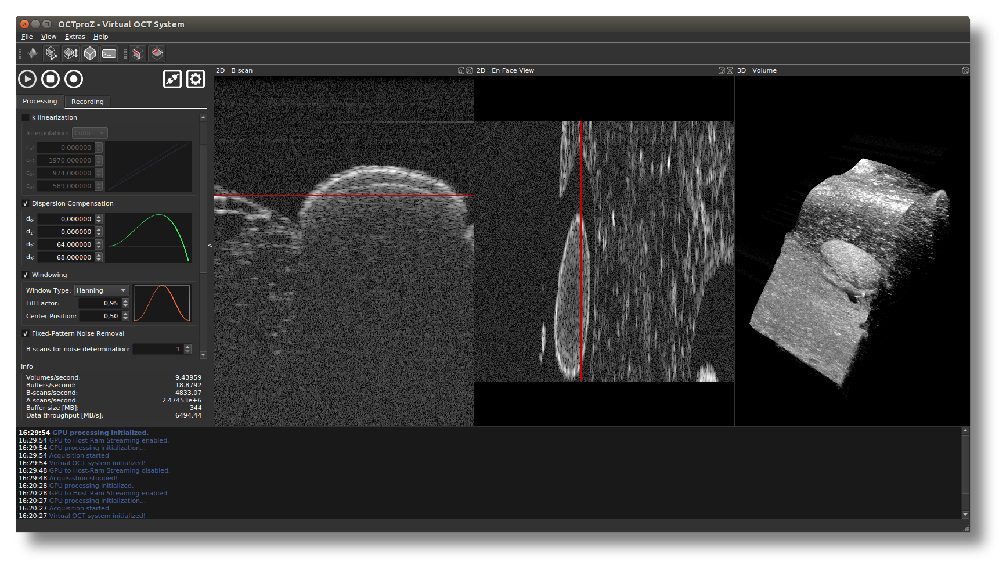
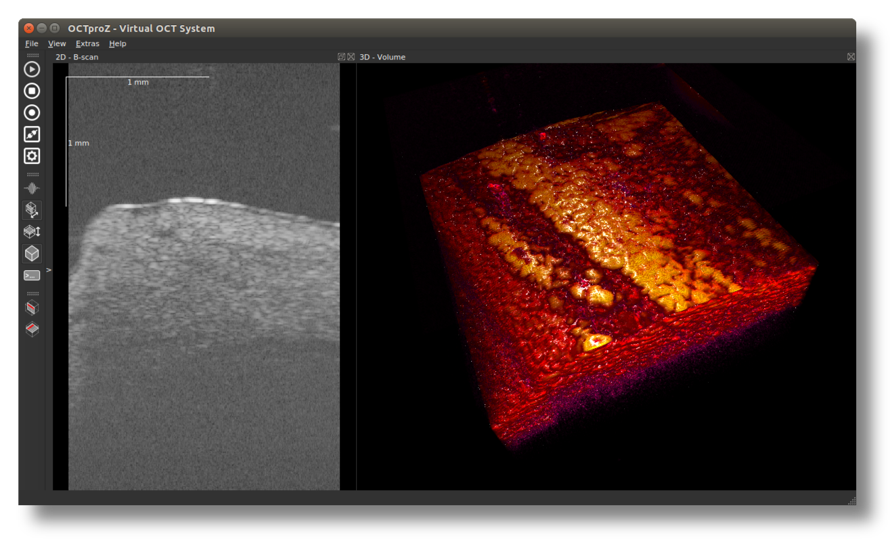
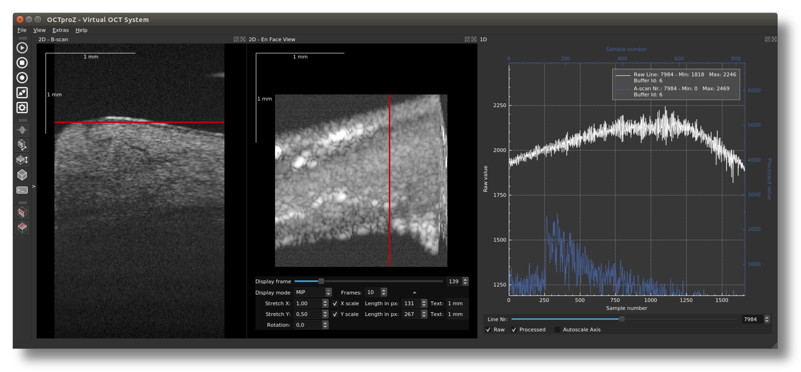
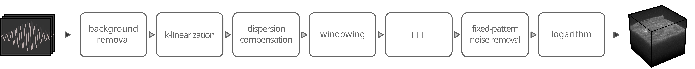

 #  OCTproZ 

OCTproZ is an open source software for optical coherence tomography (OCT) processing and visualization. A plug-in system enables the integration of custom OCT systems and software modules.

<p align="center">
  
</p>

The output windows in the screenshot above show OCT images of a strawberry. 


Video
--------
[Live OCT visualization with OCTproZ: Laser cutting a spring onion](https://www.youtube.com/watch?v=3zHdpnR9zSM)


Screenshots
--------
The following screenshots were captured on a Jetson Nano running Ubuntu 18.04:

| B-scan and volume rendering with LUT  | B-scan, en face view and 1D plot |
| ------------- | ------------- |
|   |   |


Features
--------

* **Real-time OCT processing and visualization with single GPU**  </br>
The full [OCT processing pipeline](https://spectralcode.github.io/OCTproZ/#processing-section) is implemented in [CUDA](https://developer.nvidia.com/cuda-zone) and visualization is performed with [OpenGL](https://www.opengl.org). Depending on the GPU used, OCTproZ can be used for MHz-OCT. 

* **Plug-in system** </br>
Plug-ins enable the integration of custom OCT systems and software modules. There are two kinds of plug-ins for OCTproZ: _Acquisition Systems_ and _Extensions_. An Acquisition System controls the OCT hardware and provides raw data to OCTproZ. Extensions have access to processed OCT data and can be used to extend the functionality of OCTproZ. 

* **Cross platform** </br>
OCTproZ runs on Windows and Linux. </br>
It has been successfully tested on Windows 10, Ubuntu 16.04, Ubuntu 18.04 and JetPack 4.4.1 (Jetson Nano 4 GB)


Processing Pipeline
--------
<p align="center">
  
</p>

A detailed overview of the OCTproZ processing pipeline can be found [here](https://spectralcode.github.io/OCTproZ/#processing-section).

Performance
----------
Performance highly depends on the used computer hardware and the size of the of the OCT data. A test data set with 12 bit per sample, 1024 samples per raw A-scan, 512 A-scans per B-scan and 256 B-scans per volume was used to measure the performance on different systems:

GPU           | A-scan rate without live 3D view | A-scan rate with live 3D view
------------- | ------------- | -------------
NVIDIA Quadro K620  | ~ 300 kHz ( ~2.2 volumes/s) | ~ 250 kHz ( ~1.9 volumes/s)
NVIDIA GeForce GTX 1080 Ti  | ~ 4.8 MHz (~ 36 volumes/s) | ~ 4.0 MHz (~ 30 volumes/s)

You can find more information [here](performance.md).


Plug-ins
----------
The following plug-ins are currently available:
</br></br>
__Acquisition Systems:__
|Name | Description |
|-----|-----|
|[Virtual OCT System](octproz_project/octproz_plugins/octproz_virtual_oct_system)| Can be used to load already acquired OCT raw data from the disk|


__Extensions:__
|Name | Description |
|-----|-----|
|[Demo Extension](octproz_project/octproz_plugins/octproz_demo_extension)| This demo extension is for developers. It has no useful functionality, but the code can be used as a template for developing custom extensions.|
|[Image Statistics](https://github.com/spectralcode/ImageStatisticsExtension)| Displays useful image statistics, such as a histogram, in real time of currently acquired B-scans |
|[Socket Stream](https://github.com/spectralcode/SocketStreamExtension)| Streaming of OCT data via TCP/IP. Just for slow OCT acquisitions.|
|[Phase Extraction](https://github.com/spectralcode/PhaseExtractionExtension)| Can be used to determine a suitable resampling curve for k-linearization.|

The easiest way to develop custom plug-ins is to clone/download the entire OCTproZ project, compile the DevKit and OCTproZ and use the existing examples as templates. Have a look at the [plugin developer guide](https://spectralcode.github.io/OCTproZ/developer.html). 


Download and Installation
----------
To run OCTproZ a cuda-compatible graphics card with current drivers is required.

A precompiled package for Windows (64bit) can be downloaded from:
[GitHub release section](https://github.com/spectralcode/OCTproZ/releases). Extract the zip archive and execute OCTproZ, installation is not necessary.

If you need OCTproZ for a different operating system, the easiest way is to compile it yourself. See the compiling section.

Test Dataset
----------
A test dataset that can be used with the Virtual OCT System can be downloaded from [here](https://figshare.com/articles/SSOCT_test_dataset_for_OCTproZ/12356705). 

User Manual
----------
An online version of the user manual can be found [here](https://spectralcode.github.io/OCTproZ/index.html). 

Developer Guide
----------
The plugin developer guide can be found [here](https://spectralcode.github.io/OCTproZ/developer.html). 

Compiling
---------
Compiling instructions can be found [here](BUILD.md).

Contributing
----------
Contribution guidelines can be found [here](CONTRIBUTING.md).

Long-term goals
----------
Vision and long-term goals can be found [here](vision.md).

Known issues
----------
On some Linux distributions floating dock widgets lose mouse focus when dragged. See: [Qt bug](https://bugreports.qt.io/browse/QTBUG-65640)


Publication
----------
[](https://doi.org/10.21105/joss.02580)


BibTeX:
```
@article{Zabic2020,
  doi = {10.21105/joss.02580},
  url = {https://doi.org/10.21105/joss.02580},
  year = {2020},
  publisher = {The Open Journal},
  volume = {5},
  number = {54},
  pages = {2580},
  author = {Miroslav Zabic and Ben Matthias and Alexander Heisterkamp and Tammo Ripken},
  title = {Open Source Optical Coherence Tomography Software},
  journal = {Journal of Open Source Software}
}
```


Other projects
----------
OCTproZ is not the only processing software for OCT raw data. Here is a list of other projects you should check out:

|Name | Info |
|-----|-----|
|[OCTSharp](https://github.com/OCTSharpImaging/OCTSharp) | Cuda, C# |
|[myOCT](https://github.com/MyYo/myOCT) | Matlab |
|[vortex](https://www.vortex-oct.dev/) | Cuda, C++ with Python bindings |


License
----------
OCTproZ is licensed under [GPLv3](LICENSE).</br>
The DevKit is licensed under [MIT license](octproz_project/octproz_devkit/LICENSE).
