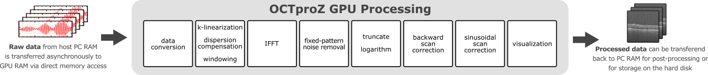

 #  OCTproZ 

OCTproZ is an open source software for optical coherence tomography (OCT) processing and visualization. A plug-in system enables the integration of custom OCT systems and software modules.

  

The output windows in the screenshot above show OCT images of a strawberry. 

Features
--------

* **Real-time OCT processing and visualization with single GPU**   
The full [OCT processing pipeline](processing.md) is implemented in [CUDA](https://developer.nvidia.com/cuda-zone) and visualization is performed with [OpenGL](https://www.opengl.org). Depending on the GPU used, OCTproZ can be used for MHz-OCT. 

* **Plug-in system**  
Plug-ins enable the integration of custom OCT systems and software modules. There are two kinds of plug-ins for OCTproZ: _Acquisition Systems_ and _Extensions_. An Acquisition System controls the OCT hardware and provides raw data to OCTproZ. Extensions have access to processed OCT data and can be used to extend the functionality of OCTproZ. 

* **Cross platform**  
OCTproZ runs on Windows and Linux.  
It has been successfully tested on Windows 10, Ubuntu 16.04 and Ubuntu 18.04

Processing Pipeline
--------

  

A detailed overview of the OCTproZ processing pipeline can be found [here](processing.md).

Performance
----------
Performance highly depends on the used computer hardware and the size of the of the OCT data. A test data set with 12 bit per sample, 1024 samples per line, 512 lines per frame and 256 frames per volume was used to measure the performance on two different systems:

GPU           | A-scan rate without live 3D view | A-scan rate with live 3D view
------------- | ------------- | -------------
NVIDIA Quadro K620  | ~ 300 kHz ( ~2,2 volumes/s) | ~ 250 kHz ( ~1,9 volumes/s)
NVIDIA GeForce GTX 1080 Ti  | ~ 4,8 MHz (~ 36 volumes/s) | ~ 4,0 MHz (~ 30 volumes/s)

The performance was measured with the full processing pipeline of OCTproZ v1.0.0. The same perfromance is expected with OCTproZ v1.2.0 if live sinusoidal scan distortion correction is disabled. 

Plug-ins
----------
To develope custom plug-ins the [DevKit](octproz_devkit) needs to be used. The easiest way to develop plug-ins is to clone/download the entire OCTproZ project, compile the DevKit and OCTproZ and use the existing examples ([Virtual OCT System](octproz_virtual_oct_system), [Demo Extension](octproz_demo_extension), [Image Statistics](https://github.com/spectralcode/ImageStatisticsExtension)) as templates.   
The following plug-ins are currently available:
  
__Acquisition Systems:__
|Name | Description |
|-----|-----|
|[Virtual OCT System](octproz_virtual_oct_system)| Can be used to load already acquired OCT raw data from the disk|

__Extensions:__
|Name | Description |
|-----|-----|
|[Demo Extension](octproz_demo_extension)| This demo extension is aimed at developers. It has no useful functionality, but the code can be used as a template for developing custom extensions.|
|[Image Statistics](https://github.com/spectralcode/ImageStatisticsExtension)| Displays useful image statistics, such as a histogram, in real time of currently acquired B-scans |

Download and Installation
----------
To run OCTproZ a cuda-compatible graphics card with current drivers is required.

A precompiled package for Windows (64bit) can be downloaded from:
[GitHub release section](https://github.com/spectralcode/OCTproZ/releases). Extract the zip archive and execute OCTproZ, installation is not necessary.
A test dataset that can be used with the Virtual OCT System can be downloaded from [here](https://figshare.com/articles/SSOCT_test_dataset_for_OCTproZ/12356705). 

If you need OCTproZ for a different operating system, the easiest way is to compile it yourself. See the compiling section.

User Manual
----------
An online version of the user manual can be found [here](https://spectralcode.github.io/OCTproZ/index.html). 

Compiling
---------
Building OCTproZ from source requires: 
- Installation of [Qt 5](https://www.qt.io/offline-installers)
- Installation of [CUDA Toolkit](https://developer.nvidia.com/cuda-downloads) (version 8 or greater)
- __Windows:__ MSVC compiler that is compatible with your CUDA version (see [CUDA installation guide for Windows](https://docs.nvidia.com/cuda/cuda-installation-guide-microsoft-windows/index.html#system-requirements))  
__Linux:__ Development environment that is compatible with your CUDA version (see [CUDA installation guide for Linux](https://docs.nvidia.com/cuda/cuda-installation-guide-linux/index.html#system-requirements)) and the third-party libraries mentioned in the [CUDA installation guide](https://docs.nvidia.com/cuda/cuda-installation-guide-linux/index.html#install-libraries)

A more detailed Linux guide for the installation steps above can be found [here](install_dev_tools.md).

How to compile:
1. Clone/Download the OCTproZ source files
2. Start Qt Creator and open [OCTproZ_DevKit.pro](octproz_devkit/OCTproZ_DevKit.pro), [virtualoctsystem.pro](octproz_virtual_oct_system/virtualoctsystem.pro) and [OCTproZ.pro](octproz/OCTproZ.pro)
3. Build OCTproZ_DevKit first and then virtualoctsystem and OCTproZ.
4. Run OCTproZ

The DevKit needs to be compiled first as it generates a folder with files that are used by OCTproZ and any plug-in at compile time.   

Contributing
----------
Contribution guidelines can be found [here](CONTRIBUTING.md).

Known issues
----------
On some Linux distributions floating dock widgets lose mouse focus when dragged. See: [Qt bug](https://bugreports.qt.io/browse/QTBUG-65640)

Publication
----------

Coming soon. In the meantime, you can contact me at  
_zabic_ _ _
_at_ 
_iqo_._uni_-_hannover_._de_ 

Authors: 
Miroslav Zabic1, 2, Ben Matthias2, Alexander Heisterkamp1, Tammo Ripken2 
1Institute of Quantum Optics, Leibniz University Hannover, Welfengarten 1, 30167 Hannover, Germany 
2Industrial and Biomedical Optics Department, Laser Zentrum Hannover e.V., Hollerithallee 8, 30419 Hannover, Germany 

License
----------
OCTproZ is licensed under [GPLv3](LICENSE). 
The DevKit is licensed under [MIT license](octproz_devkit/LICENSE).

