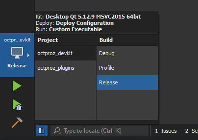

# Plugin Developer Guide for OCTproZ

*Date: April 19, 2022*

## About this Developer Guide

So you have decided to take a look at the inner workings of the [OCTproZ](https://github.com/spectralcode/OCTproZ) plugin system! Maybe even write a plugin yourself!? That's cool! This plugin developer guide will help you with that.

There is also an user manual that can be found [here](../index.md).

## Before You Start

In order to write your own plugins, you need to make sure that you are able to compile the [OCTproZ DevKit](https://github.com/spectralcode/OCTproZ/tree/master/octproz_project/octproz_devkit). Have a look at the compiling instructions on the OCTproZ project page on [GitHub](https://github.com/spectralcode/OCTproZ).

## Plugin System

Plugins are dynamic libraries that extend the functionality of OCTproZ. To develop custom plugins the [DevKit](https://github.com/spectralcode/OCTproZ/tree/master/octproz_project/octproz_devkit) needs to be used. After downloading and compiling the DevKit code, you get a static library and a collection of C++ header files that specify which classes and methods must be implemented in order to create a custom plugin.

The DevKit defines two types of plugins: Extensions and Acquisition Systems. This can also be seen in the following UML class diagram:


***Extensions*** are software modules that extend the functionality of an OCT system (e.g. software control of a liquid lens) or provide additional custom defined post processing steps. Extensions have access to raw and processed OCT data, this makes them perfectly suited for implementation of closed loop control algorithms (e.g. for wavefront sensorless adaptive optics).

***Acquisition Systems*** represent software implementations of actual or virtual OCT systems. Their main task is to control the OCT hardware setup and to provide raw data to OCTproZ.

Your custom plugin must inherit from either **Extension** or **AcquisitionSystem** and implement all the virtual methods from the base class. All methods shown in italics in the class diagram above are virtual.

The meaning and functionality of all attributes and methods is documented in the header files of the DevKit. For example have a look at [extension.h](https://github.com/spectralcode/OCTproZ/blob/master/octproz_project/octproz_devkit/src/extension.h).

## Extensions

First of all, you should read the source code of one of the provided Extensions:

- Basic example: [Demo Extension](https://github.com/spectralcode/OCTproZ/tree/master/octproz_project/octproz_plugins/octproz_demo_extension)
- More advanced example: [Image Statistics Extension](https://github.com/spectralcode/ImageStatisticsExtension)

It is recommended to use one of the examples as a template for your own Extension!

The two most intresting methods that you need to implement are `void rawDataReceived(void* buffer, ...)` and `void processedDataReceived(void* buffer, ...)`. These methods are called automatically by OCTproZ every time new data is available. You can access the data through the provided pointer to the buffer. In most cases you are not interested in the raw data so you can leave the implementation of `void rawDataReceived(...)` empty or you can use `Q_UNUSED` to suppress compiler warnings. This may look like this:

```cpp linenums="1"
void YourCustomExtension::rawDataReceived(void* buffer, unsigned bitDepth, unsigned int samplesPerLine, unsigned int linesPerFrame, unsigned int framesPerBuffer, unsigned int buffersPerVolume, unsigned int currentBufferNr) {
	//do nothing here as we do not need the raw data. Q_UNUSED is used to suppress compiler warnings
	Q_UNUSED(buffer)
	Q_UNUSED(bitDepth)
	Q_UNUSED(samplesPerLine)
	Q_UNUSED(linesPerFrame)
	Q_UNUSED(framesPerBuffer)
	Q_UNUSED(buffersPerVolume)
	Q_UNUSED(currentBufferNr)
}
```

To actually access processed OCT data, for example to check whether a certain pixel value is greater than a threshold value, you could implement `void processedDataReceived(...)` like this:

```cpp linenums="1"
void YourCustomExtension::processedDataReceived(void* buffer, unsigned bitDepth, unsigned int samplesPerLine, unsigned int linesPerFrame, unsigned int framesPerBuffer, unsigned int buffersPerVolume, unsigned int currentBufferNr) {
	//check if buffer can be accessed
	if(this->processedGrabbingAllowed){

		//check bit depth (depends on your acquisition hardware)
		if(bitDepth == 16){
	
			//cast buffer type according to bit depth (8bit = uchar, 16bit = ushort, 32bit = uint)
			unsigned short* bufferArray = (unsigned short*)buffer;
	
			//access the very specific pixel number 42 in the buffer to check if its value has exceeded a threshold value
			unsigend short threshold = 9000; 
			if(bufferArray[42] > threshold){

				//emit info signal to display info text in OCTproZ message console
				emit info("Pixel 42 is over 9000!");
			}
		}
	}
}
```

Depending on what you want to do with the processed data that you can access via the buffer, you should consider to copy the relevant buffer data and process it on a different thread. In addition, you should not accept any new incoming data while you are still processing the previous buffer. Have a look at the source code of [Image Statistics Extension](https://github.com/spectralcode/ImageStatisticsExtension) to see one possible implementation of that.

After you have compiled your Extension place the resulting dynamic library (".dll" in Windows and ".so" in Linux) into a folder "plugins" that should be in the same location as the executable of OCTproZ. Start OCTproZ and you should see your Extension in the Extension menu!

## Acquisition Systems

First of all, you should read the source code of the provided Acquisition System example:

- Basic example: [Virtual OCT System](https://github.com/spectralcode/OCTproZ/tree/master/octproz_project/octproz_plugins/octproz_virtual_oct_system)

It is recommended to use this example as a template for your own Acquisition System!

The two most important methods that you need to implement are `void startAcquisition()` and `void stopAcquisition()`. These methods are called automatically by OCTproZ as soon the user starts or stops the OCT acquisition.

In `void startAcquisition()`

- the OCT hardware should be initialized and started (e.g. scanners, acquisition board, ...)
- the acquisition buffer, which is a double buffer, needs to be filled with acquired OCT raw data
- the corresponding boolean flag for the acquisition buffer needs to be set to true. The processing thread in the main application continuously checks this acquisition buffer flag to transfer the acquired raw data to GPU as soon as the acquisition buffer is filled.

In `void stopAcquisition()`

- the OCT hardware should be deinitialized and stopped

The actual implementation of these two methods depends heavily on the used OCT hardware configuration. Please refer to the documentation of your hardware components.

After you have compiled your Acquisition System place the resulting dynamic library (".dll" in Windows and ".so" in Linux) into a folder "plugins" that should be in the same location as the executable of OCTproZ. Start OCTproZ and you should see your Acquisition System in the system manager (*File → Open System*)!

## Compile Plugins

This secion shows you how to compile the demo extension without needing to compile OCTproZ.

Before you start make sure that you have installed the MSVC compiler on your system, that you have downlaoded the [precompiled version of OCTproZ](https://github.com/spectralcode/OCTproZ/releases) and that you are able to run OCTproZ.exe.

1. Download the OCTproZ source code from [GitHub](https://github.com/spectralcode/OCTproZ) and unzip it to a path that does not contain any spaces.


2. You just need the folders *octproz_devkit* and *octproz_plugins*. If you like you can move them to a different location. Each folder contains a .pro file. Open them with the Qt Creator.


3. Configure the Qt projects by selecting the MSVC2015 64bit kit (MSVC2017 64bit and MSVC2019 64bit should work as well because libraries compiled by these compilers are binary-compatible)


4. Set the build configuration of *octproz_devkit* and *octproz_plugins* in Qt Creator to **Release**



5. Build the devkit project first and then build the demo extension plugin or the whole plugins project in Qt Creator.


6. The build process should have created a couple of folders by now. Open the build folder of the demo extension project and look for *DemoExtension.dll*. Copy the dll to the plugins folder of the precompiled OCTproZ package.


7. Run OCTproZ and you should be able to start the demo extension.


8. Feel free to modify the demo extension and have fun!
