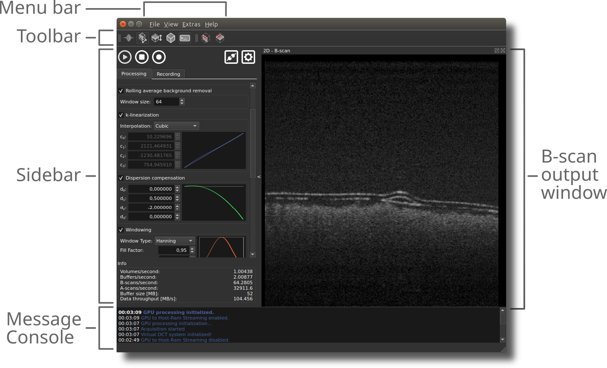

# Core Functionality

This section explains the core functionality accessible through the GUI, excluding any plugin features.


## Overview of the graphical user interface

<figure markdown="span">
	
	<figcaption>Overview of the main GUI elements of OCTproZ</figcaption>
</figure>

- **Menu Bar**: Contains the menus `File`, `View`, `Extras`, and `Help`. Plugins can be accessed through `Extras → Extension`.
- **Toolbar**: Provides direct access to frequently used functionalities, such as opening output windows, displaying the messaging console, and enabling/disabling the orientation marker within the B-scan and en face view.
- **Sidebar**: This is the central control interface. At the top, it contains the *Start Acquisition*, *Stop Acquisition*, *Start Recording*, *Connect OCT System*, and *OCT System Settings* buttons. The sidebar also includes the Processing and Recording tabs, as well as additional plugin-related tabs (if activated). At the bottom, it features an information area that displays current acquisition speed.
- **Messaging Console**: Displays info and error messages.
- **Output Windows**:  Includes 1D, B-scan, en face view, and volume windows, which can be enabled through the toolbar or the `View` menu in the menu bar. 

## Processing tab
The processing tab in the sidebar allows you to control all signal processing settings. For an in-depth explanation of each processing step, refer to the [processing section](processing.md). Below is a brief description of each parameter available in the processing tab:

| Parameter                          | Description |
|-----------------------------------|--------------|
| Bit shift raw sample values by 4   | Divides each raw sample value by 16 (for digitizers storing 12-bit samples in 16-bit words). |
| Sinusoidal scan correction         | Corrects distortions from sinusoidal scanning motion via linear interpolation. |
| Flip every second B-scan           | Unflips every second B-scan in bidirectional scanning schemes. |
| Rolling average background removal | Removes the DC background using a rolling average filter. |
| Window size                        | Number of samples used for rolling average background removal. |
| k-linearization                    | Resamples raw data for uniform k-space sampling. |
| Interpolation                      | Method used for resampling during k-linearization (Linear, Cubic Spline, Lanczos). |
| c<sub>0</sub> to c<sub>3</sub>     | Coefficients for resampling curve polynomial used for k-linearization. |
| Dispersion compensation            | Numerically compensates for dispersion mismatch between OCT sample and reference arms. |
| d<sub>0</sub> to d<sub>3</sub>     | Coefficients for dispersion compensation phase function. d<sub>0</sub>: no effect, d<sub>1</sub>, shifts OCT image axially, d<sub>2</sub> and d<sub>3</sub>: affect axial resolution |
| Windowing                          | Applies a window function to reduce side lobes in the IFFT result. |
| Window Type                        | Selects the window function type (Gaussian, Hann, Sine, Lanczos, Rectangular). |
| Fill Factor                        | Controls the width of the window function. |
| Center Position | Defines the center of the window function. Typically set to 0.5, but can be adjusted (especially with a narrow window width) to select a specific spectral range for OCT processing. |
| Fixed-pattern noise removal        | Removes structural artifacts (static horizontal lines). |
| B-scans for noise determination    | Number of B-scans used to determine the fixed-pattern noise profile. |
| Log scaling                        | Applies logarithmic scaling. |
| Max value                          | Sets the upper limit for grayscale scaling (in dB if log scaling is enabled; linear otherwise). |
| Min value                          | Sets the lower limit for grayscale scaling. (in dB if log scaling is enabled; linear otherwise). |
| Multiplicator                      | Adjusts image contrast in grayscale conversion. Typically this is set to 1.0. |
| Offset                             | Adjusts image brightness in grayscale conversion. Typically this is set to 0.0. |
| Post processing background removal | Subtracts a pre-recorded background A-scan to reduce static artifacts that are not removed by DC background removal and fixed pattern noise removal. |
| Weight                             | Scaling factor for background subtraction. |

For easy access, you can load custom resampling curves not only through `Extras → Resampling Curve for K-linearization`, but also by right-clicking inside the *k-linearization* group box (outside of the plot). For example, you can right-click right next to the *Interpolation* drop-down menu and a context menu will appear where you can select to load a custom resampling curve.


## Recording tab

The Recording tab in the sidebar allows you to configure recording settings.

Before pressing the *Record* button, you must configure these settings—especially the **recording path**. If the recording path is not set, recording will not occur, and you will receive an error message in the message console.

The configured settings are applied to all recordings. Each recorded file will be automatically named using the following format:

```
yyyyMMdd_hhmmsszzz_<yourfilename>_<processed|raw>.raw
```

### Filename breakdown
- `yyyy` = **Year** (4 digits)  
- `MM` = **Month** (2 digits)  
- `dd` = **Day** (2 digits)  
- `hh` = **Hour** (2 digits, 24-hour format)  
- `mm` = **Minute** (2 digits)  
- `ss` = **Second** (2 digits)  
- `zzz` = **Milliseconds** (3 digits)  
- `<yourfilename>` = The custom filename you provide in the recording settings  
- `<processed|raw>` = Indicates whether the recording is **processed** or **raw** data  
- `.raw` = The file extension (recording is saved as a raw binary file)

**Example filename:**

```
20250427_153045123_apple1_processed.raw
```

In this example:

- The recording was made on **April 27, 2025**, at **15:30:45.123** (3:30 PM and 45.123 seconds).
- The user-provided filename was `apple1`.
- The file contains **processed** data.

You also have the option to set a description text, which is saved in a meta file alongside the recording (if save meta information is enabled). The meta file contains all the processing and recording settings used at the time of recording. This meta file is the same as the settings file that can be saved and loaded through the menu bar (see section [Saving and Loading Settings](#saving-and-loading-settings)).

###Recording parameter

Below is a brief description of each parameter available in the recording tab:

| Parameter                                   | Description |
|---------------------------------------------|------------|
| Recordings folder                           | Sets the destination folder where recordings are saved. |
| Screenshots                                 | Enables saving of screenshots of the currently visible output windows (B-scan, en face view, volume) during recording. |
| Raw buffers                                 | Enables recording of raw spectral buffers. |
| Processed buffers                           | Enables recording of processed data buffers. |
| Recording name                              | Specifies the name of the recording session. This name will be included as part of the file name. |
| Description                                 | Adds a text description that is saved in the meta file. |
| Start recording with first buffer of volume | Starts recording with the first buffer of a volume. This is only useful if you have multiple buffers per volume and want to guarantee that recording begins with the first buffer of the volume, rather than the buffer that is currently being acquired when the record button is pressed. |
| Stop acquisition after record               | Stops data acquisition and processing automatically after the recording is complete. |
| Save meta information                       | Saves additional meta information alongside recorded data. Same as `File → Save Settings to File`. |
| Save processed buffers as 32-bit float | Saves processed data buffers in 32-bit floating-point format. If disabled, the data will be saved using the same bit depth as the input raw data. |
| Buffers to record                           | Sets the number of buffers to record. |


## Scheduled recording

The Recording Scheduler (screenshot below) is available under `Extras → Scheduled Recording`. It allows you to automatically perform recordings at defined intervals, useful for generating time-series. 

<figure markdown="span">
	
	<figcaption>Recording Scheduler Interface</figcaption>
</figure>

!!! note
    Ensure the interval between recordings is longer than the total time needed for a single recording (data acquisition + saving to disk). Overlapping recordings are not possible. If a recording takes longer than the defined interval a warning is shown, and the scheduler will retry after a 10-second delay.

| Parameter | Description |
|-----------|-------------|
| Start first recording in | Time delay before the first recording starts after clicking *Start Schedule* (format: hh:mm:ss). |
| Wait between recordings | Interval between the start times of consecutive recordings (format: hh:mm:ss). |
| Total recordings | Total number of recordings to perform in the scheduled task. |


## Saving and loading settings

- `File → Save Settings to File`: Saves the current configuration (processing parameters, recording setup, system settings, and active plugins) to an `*.ini` file.
- `File → Load Settings from File`: Loads a previously saved settings file.


## Saving and loading view layout

- `View → Save Current Layout to File`: Saves the current window arrangement, visibility states, and panel sizes to an `*.ini` file.
- `View → Load Layout from File`: Restores a previously saved layout file.

!!! note
    All extension settings (including layout information, if provided by the extension) are currently stored in the settings file. This behavior may change in the future.

