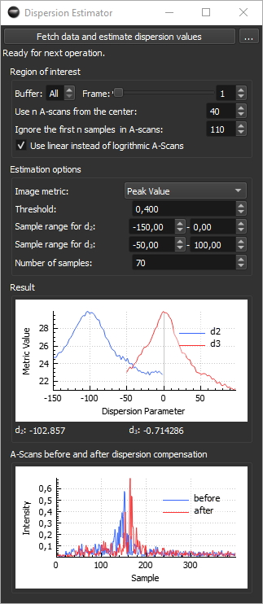

# Dispersion Estimator Extension


The Dispersion Estimator can be used to estimate suitable dispersion values \( d_2 \) and \( d_3 \) to improve axial resolution in the OCT images. This is done by automatically varying these dispersion parameters and calculating an A-scan quality metric. The resulting parameters that yield the maximal metric value are directly applied to the OCTproZ sidebar.

<figure markdown="span">
    
    <figcaption>Dispersion Estimator Extension Interface</figcaption>
</figure>


## How it works

The extension grabs a single raw frame and temporarily stores it. From this frame, a user-defined number of spectra are selected from the central region. OCT processing is then performed repeatedly on these spectra, while varying the dispersion coefficients to optimize the image quality. The optimization is done in two steps:

1. In the first step, \(d_3\) is fixed at 0, while \(d_2\) is varied within a user-defined range and step size. For each value of \(d_2\), the corresponding A-scans are processed and evaluated using the selected image quality metric. The metric values from all A-scans are averaged to produce a single score for each \(d_2\), which is plotted in the result plot.
2. In the second step, the \(d_2\) value that produced the best image quality is fixed, and \(d_3\) is varied in the same way. Again, the metric is evaluated and plotted.

The resulting optimal values of \(d_2\) and \(d_3\) — those producing the highest quality metric — are displayed below the result plot and automatically transferred to the OCTproZ sidebar for immediate use.

The approach of grabbing a single frame and using it for the entire optimization process allows the extension to be used even during live imaging with moving samples.


## How to use

!!! note
	Perform k-linearization before attempting to numerically compensate dispersion! 
	The numerical dispersion compensation algorithm assumes k-linearized data and will only perform reliably under this condition.

1. Start OCTproZ processing.

2. Set the region of interest. Typical settings are:  
	- *Buffer*: All  
	- *Frame*: 0  
	- *Use A-scans from the center*: 40  
	- *Ignore the first n samples in A-scans*: 20  
	- *Use linear instead of logarithmic A-scans*: enabled  

3. Configure the estimation options. These parameters need to be adjusted by trial and error, as they strongly depend on your OCT system and the sample structure visible in the OCT image.  
	- In most cases, the image metrics *Peak Value* or *Mean Sobel* yield good results. For these metrics, the *Threshold* parameter is not used.  
	- Select the *Sample range for \(d_2\)* and *\(d_3\)* such that the result plots show a clear curve with a single distinct peak. As a first guess you can start with -100 to 100 and 50 samples.

4. Press *Fetch data and estimate dispersion values*.

5. Check the result curves. Ideally, both \(d_2\) and \(d_3\) result plots should show a clear peak.  
	If this is not the case:  
	- Adjust the sample ranges for \(d_2\) and/or \(d_3\).  
	- Try a different image metric.  
	- Consider increasing or decreasing *Ignore the first n samples in A-scans*.  

6. Press *Fetch data and estimate dispersion values* again and repeat the process until a clear peak is visible in both plots.


## Image metrics
| Metric | Description |
|-----------|-------------|
| Sum Above Threshold | Calculates the sum of all A-scan sample values that exceed a specified threshold. Higher values indicate more signal energy above the threshold. The *Threshold* parameter must be set. |
| Samples Above Threshold | Counts the number of A-scan samples that exceed a specified threshold. Inspired by [Maciej Wojtkowski et al. (2004)](https://doi.org/10.1364/OPEX.12.002404). The *Threshold* parameter must be set. |
| Peak Value | Returns the maximum value within the A-scan. This metric is independent of the *Threshold* parameter and works well when the signal has a distinct peak. |  
| Mean Sobel | Calculates the sum of the absolute values of the axial gradient within each A-scan and averages these sums across all A-scans. This metric is independent of the *Threshold* parameter. It probably works well for structures with multiple layers. |

## User interface
| Button | Description |
|-----------|-------------|
| Fetch data and estimate dispersion values| When pressed, a single raw frame is grabbed from the current acquisition. For this to work, OCTproZ processing must be running. |
| ... | hide/show settings. Hide/show settings. This is useful when suitable parameters for the estimation process have already been found, and you only want to start the optimization without the extension GUI occupying too much space. |


| Parameter | Description |
|-----------|-------------|
| Buffer |  The buffer number from which you want to grab the frame. If you only use one buffer per volume, or if it does not matter which specific frame is used for the estimation, select All. This will grab the frame from the next available buffer. |
| Frame | The frame number within the buffer. Together with the buffer number, this allows you to select the specific frame within the OCT volume that should be grabbed. If you only use one frame per buffer, or if it does not matter which specific frame is used for the estimation, select 0. |
| Use n A-scans from the center | Number of raw A-scans from the central region of a frame that should be used for the optimization. |
| Ignore the first n samples in A-scans | The number of samples at the beginning of each A-scan that should be excluded from the image metric calculation. This is useful if your OCT image contains artifacts, such as a DC component or autocorrelation artifacts at the top, and you want to ignore the upper part of the frame. |
| Use linear instead of logarithmic A-scans | If checked, the A-scans are not converted to a logarithmic scale after the FFT but are used in their linear representation for the optimization. In most cases, this yields better results. |
| Image metric | This is the metric calculated from the A-scans. A good metric will produce a smooth curve with a single distinct peak, representing the OCT image with the best axial resolution. Depending on your OCT system and the sample, different metrics may perform better. |
| Threshold | This parameter only applies to the image metrics _Sum Above Threshold_ and _Samples Above Threshold_. It defines an A-scan intensity value (see plot _A-Scans before and after dispersion compensation_). |
| Sample range for \(d_2\) | Start and end values of the dispersion parameter \(d_2\)​ over which the optimization will search for the best image metric. |
| Sample range for \(d_3\) | Start and end values of the dispersion parameter \(d_3\)​ over which the optimization will search for the best image metric. |
| Number of samples | The number of \(d_2\) and \(d_3\)​ values to test within the defined sample range. This directly controls the step size between each sample. |


### Remote control

You can start the estimation process remotely using the [SocketStreamExtension](https://github.com/spectralcode/SocketStreamExtension) by sending the command:

```
remote_plugin_control, Dispersion Estimator, startSingleFetch
```
