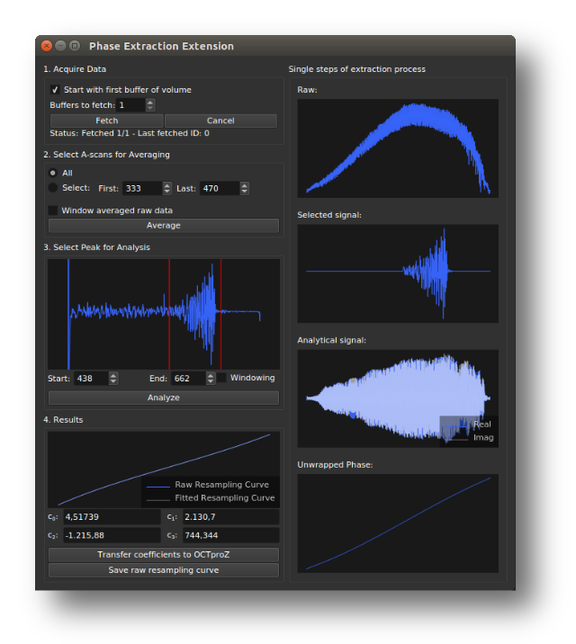

# Phase Extraction Extension

The Phase Extraction Extension can be used to generate a resampling curve for k-linearization by extracting the phase of a calibration signal.

<figure markdown="span">
	
	<figcaption>Phase Extraction Extension Interface</figcaption>
</figure>

## How it works

The plugin extracts the instantaneous phase of a calibration signal and uses it to generate a resampling curve for k-linearization.
The processing steps are shown in the figure below. 

<figure markdown="span">
	
	<figcaption>Processing steps for generating a resampling curve for k-linearization. The instantaneous phase of an averaged autocorrelation signal is extracted using FFT, windowing, IFFT, and phase unwrapping. The inverse of the phase is the resampling curve.</figcaption>
</figure>

First, one or multiple buffers of raw data are acquired and averaged. The averaged interferogram is Fourier-transformed, and a window is applied to isolate the calibration signal in the positive sideband. This windowed signal is then inverse Fourier-transformed, resulting in a complex signal. The phase is extracted using atan2 on the real and imaginary parts, then unwrapped to obtain the instantaneous phase. Finally, the instantaneous phase is inverted to get the resampling curve. The inversion can be thought of as swapping the axes or mirroring the phase signal along the 45° diagonal.

This method also works in the presence of a sample signal, as the averaging and windowing steps suppress most unwanted contributions, leaving only the calibration signal.

Further details can be found in this conference [paper](https://doi.org/10.15488/11355).

## How to Use
1. Start OCTproZ processing.  
2. Generate a calibration signal, for example by placing a optical window in front of the OCT reference mirror.  
3. Open the Phase Extraction Extension and fetch raw data using the _Fetch_ button.  
4. Select A-scans for averaging (typically, selecting _All_ works best, but you can also choose a specific range) and click on _Average_.  
5. Select the calibration peak by setting the _Start_ and _Dnd_ positions, then click on _Analyze_.  
6. In the _Results_ area, you can choose to ignore a number of samples at the beginning and end of your signal. This is useful if your interferogram is zero or close to zero at the edges. Then, click on _Fit_.  
7. Use the result by either transferring the coefficients of the polynomial fit to the OCTproZ sidebar via click on _Transfer coeffs_, or by using the raw resampling curve. For the latter, click on _Transfer curve_ to automatically apply the curve to OCTproZ processing, or click on _Save curve_ to export the raw resampling curve as a CSV file.

!!! note
	It is important that the calibration signal is free from phase distortions caused by dispersion imbalance. Otherwise, the extracted instantaneous phase will include both the dispersion-related phase and the phase caused by non-linear k-sampling, and the resulting resampling curve will not correctly linearize the data in k-space.

A very simple way to generate a calibration signal that is free from dispersion imbalance is by placing a wedged optical window or an optical window with an anti-reflection coating on one side in front of the reference mirror. The light is mainly reflected back from the back surface of the optical window and the mirror. The back-reflected beams interfere with each other, generating an autocorrelation signal. The optical window should be thick enough so that any possible autocorrelation signal from the front and back surfaces of the window does not appear within the OCT imaging range, or at least does not overlap with the calibration signal. The distance between the back surface of the optical window and the mirror should be chosen such that the calibration signal appears somewhere in the bottom half of the B-scan.

The following image illustrates the basic idea of how the autocorrelation signal is generated using the optical window–mirror combination.

<figure markdown="span">
	
	<figcaption>Generation of a calibration signal using a optical window–mirror setup.
</figcaption>
</figure>

A video demonstrating the use can be found [here](https://www.youtube.com/watch?v=nlBWCv9TDJ8)

## Demo data set
A demo dataset can be found [here](https://figshare.com/articles/dataset/Swept_Source_OCT_test_dataset_for_OCTproZ_Phase_Extraction_Extension/20098094).
You can use it with the Virtual OCT System to test the Phase Extraction Extension offline. 

## User interface

| Parameter | Description |
|-----------|-------------|
| Start with first buffer of volume | If checked, fetching starts from the first buffer of the volume. This should only be enabled if you have multiple buffers per volume and want to explicitly select a specific region for use in the Phase Extraction Extension. |
| Buffers to fetch | Number of buffers to fetch for averaging. |
| Select A-scans for averaging | Choose either *All* A-scans or specify a range using *First* and *Last*. |
| Window averaged raw data | If enabled, a Hann window will be applied over the entire averaged interferogram. |
| Start | Position (sample number) marking the beginning of the calibration peak. |
| End | Position (sample number) marking the end of the calibration peak. |
| Windowing | If enabled, a Hann window will be used instead of a rectangular window to isolate the selected calibration peak. |
| ignore first | Number of samples to ignore at the beginning of the interferogram during polynomial fitting. This is useful if the signal intensity is zero or close to zero at the start, to ensure a good polynomial fit. |
| ignore last | Number of samples to ignore at the end of the interferogram during polynomial fitting. |
| c0 to c3 | Coefficients of the polynomial fitted to the raw resampling curve. |

| Button | Description |
|--------|-------------|
| Fetch | Start fetching the data. |
| Cancel | Cancel the fetching process. |
| Average | Start averaging the fetched data. |
| Analyze | Perform signal processing to generate the resampling curve. |
| Fit | Perform a polynomial fit on the raw resampling curve. This is usually done automatically, but if you change the values for _ignore first_ or _ignore last_, you should run the fit again. |
| Transfer coeffs | Transfer the fitted coefficients \(c_0\) to \(c_3\) to OCTproZ. |
| Transfer curve | Transfer the raw resampling curve to OCTproZ. |
| Save curve | Save the resampling curve to a file. |

