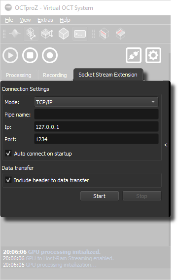

# Socket Stream Extension

Socket Stream enables remote control of OCTproZ and allows streaming of processed data to another application, either on the same computer or on a different computer within the same network.
Supported communication protocols are: TCP/IP, WebSocket and IPC. IPC is implemented using Qt's `QLocalServer` and `QLocalSocket`, which use *Unix Domain Sockets* on Linux and *Named Pipes* on Windows.

One example use case is transferring OCT data to a Python application for post-processing.

Another example is remotely controlling a small, portable OCT system that either has no display or only a limited display, via a smartphone or tablet.

<figure markdown="span">
	
	<figcaption>Socket Stream Extension Interface</figcaption>
</figure>

## How to use

1. Create a custom client application ([see Python examples here](https://github.com/spectralcode/SocketStreamExtension/tree/main/examples))
   or use this [WebSocket client that runs in a browser](https://spectralcode.github.io/octproz-socket-stream-extension/examples/octproz_websocket_client.html).

2. Set the communication protocol, IP, and port (or the pipe name in case of IPC) in the Socket Stream extension.

3. Click *Start* to start the server.

4. Connect your client to the server using the configured IP and port.

5. If you want to stream image data to your client, it is recommended to connect a second client:
   Use one client for commands only (activate with the command `enable_command_only_mode`)
   and a second client for image streaming only.

6. Use commands (see table below).

## User interface

| Parameter | Description |
|-----------|-------------|
| Mode | Selects the communication protocol: TCP/IP, IPC (Local Sockets), or WebSocket. |
| Pipe name | Name of the IPC pipe (used only in IPC mode). |
| IP | IP address of the server (used in TCP/IP and WebSocket modes). |
| Port | Port number of the server (used in TCP/IP and WebSocket modes). |
| Auto connect on startup | Automatically starts the server when the extension is activated. |
| Include header to data transfer | Adds a 13-byte header to every data packet containing meta information like image size and bit depth. |

## Data header

If enabled, each transmitted data packet starts with a 13-byte header containing meta information about the OCT image. This allows the client to correctly interpret the incoming data.

The header consists of:

| Field | Type (Size) | Description |
|-------|-------------|-------------|
| Magic Number | unsigned int (4 bytes) | Fixed value `299792458` (decimal) for synchronization |
| Data Size | unsigned int (4 bytes) | Total size of image data in bytes |
| Frame Width | unsigned short (2 bytes) | Number of pixels per A-scan |
| Frame Height | unsigned short (2 bytes) | Number of A-scans per frame |
| Bit Depth | unsigned char (1 byte) | Bits per pixel (e.g., 8 or 16) |

## Available Remote Commands

Socket Stream supports remote commands to control OCT processing, recording, processing parameters, line-field OCT options, and plugin forwarding. Commands are sent as newline-terminated strings over the socket connection.

### Processing Control

| Command | Description |
|---------|-------------|
| `remote_start` | Starts OCT processing. |
| `remote_stop` | Stops OCT processing. |
| `stream_raw` | Streams raw acquisition buffers instead of processed OCT data. |
| `stream_processed` | Streams processed OCT data. |
| `set_raw_only_mode:enable=<0\|1>` | Enables or disables raw only mode. |
| `set_raw_only_params:samples=<N>:ascans=<N>:bscans=<N>:buffers=<N>:bitdepth=<N>` | Configures the raw only mode acquisition profile. |

### Recording

| Command | Description |
|---------|-------------|
| `remote_record` | Starts recording using the current recording settings. |
| `remote_record:<path>` | Sets the recording save folder, then starts recording. |
| `remote_record:<path>\|<name>` | Sets the recording save folder and file name, then starts recording. |
| `set_rec_path:<path>` | Sets the recording save folder. The path must already exist. |
| `set_rec_name:<name>` | Sets the recording file name. |
| `set_buffers_to_record:<N>` | Sets the number of buffers to record. `N` must be greater than 0. |
| `set_rec_options:<key>=<val>:...` | Sets recording option flags. See the keys below. |
| `set_preallocation:<0\|1>` | Enables or disables recording buffer preallocation. |

The `|` character separates path from name in `remote_record:<path>|<name>`. This avoids ambiguity with colons in Windows paths.

Examples:

- `remote_record:C:/Users/username/data|experiment_001`
- `remote_record:/home/username/data|experiment_001`
- `set_buffers_to_record:256`

Recording commands that change settings modify OCTproZ's internal recording parameters directly. They do not update the sidebar controls, so later sidebar interaction can overwrite remotely set values.

#### Recording Options

Only specified `set_rec_options` keys are changed. Omitted keys keep their current values. Values are booleans: `1`/`true` or `0`/`false`.

| Key | Description |
|-----|-------------|
| `raw` | Records raw buffers. |
| `processed` | Records processed buffers. |
| `screenshot` | Saves screenshots. |
| `meta` | Saves metadata. |
| `stop_after` | Stops acquisition after recording. |
| `start_first` | Starts recording with the first buffer. |
| `float32` | Saves as 32-bit float. |

Example:

- `set_rec_options:raw=1:processed=1:meta=0:stop_after=1`

When preallocation is enabled with `set_preallocation:1`, recording memory is allocated immediately. Use `set_preallocation:0` to free the preallocated memory.

### Settings

| Command | Description |
|---------|-------------|
| `load_settings:<path>` | Loads OCTproZ settings from a file. |
| `save_settings:<path>` | Saves the current OCTproZ settings to a file. |

Examples:

- `load_settings:C:/Users/username/octproz_settings.ini`
- `save_settings:C:/Users/username/octproz_settings_backup.ini`

### Processing Parameters

| Command | Description |
|---------|-------------|
| `set_disp_coeff:<c1>:<c2>:<c3>:<c4>` | Sets dispersion coefficients. Each value can be a double, `null`, or `nullptr`; `null`/`nullptr` leaves that coefficient unchanged. |
| `set_grayscale_conversion:<log>:<max>:<min>:<mult>:<offset>` | Configures grayscale conversion. `log` accepts `true`/`1` or `false`/`0`; the numeric values can be doubles, `nan`, `null`, or `nullptr`. |
| `set_klin_coeffs:<c0>:<c1>:<c2>:<c3>` | Sets k-linearization polynomial coefficients. Each value can be a double, `null`, or `nullptr`. |
| `set_klin_curve:<v0>,<v1>,...,<vN>` | Sets a custom k-linearization resampling curve from comma-separated float values. |
| `load_klin_curve:<file_path>` | Loads a k-linearization resampling curve from a CSV file. |

Examples:

- `set_disp_coeff:0.0:1.5e-6:0.0:0.0`
- `set_disp_coeff:null:1.5e-6:null:null`
- `set_grayscale_conversion:true:255:0:1.0:0.0`
- `set_klin_coeffs:null:1.0:0.0:0.0`
- `set_klin_curve:0.0,1.0,2.0,3.0`
- `load_klin_curve:C:/Users/username/curves/klin_curve.csv`

The CSV file used by `load_klin_curve` should use semicolons as delimiters and store the resampling value in the second column. The first line is skipped as a header, matching OCTproZ's sidebar import format.

### Raw Only Mode

Raw only mode streams raw acquisition buffers without GPU processing. It uses a separate acquisition profile, so normal acquisition parameters are not changed by raw only commands.

Only acquisition systems that explicitly support raw only mode can use these commands. Unsupported systems reject the request.

| Command | Description |
|---------|-------------|
| `set_raw_only_mode:enable=<0\|1>` | Enables or disables raw only mode. |
| `set_raw_only_mode:enable=1:samples=<N>:ascans=<N>:bscans=<N>:buffers=<N>:bitdepth=<N>` | Updates raw only parameters and enables raw only mode in one command. |
| `set_raw_only_params:samples=<N>:ascans=<N>:bscans=<N>:buffers=<N>:bitdepth=<N>` | Updates the stored raw only acquisition profile. All keys are optional, but at least one key must be provided. |

When raw only mode is enabled, Socket Stream automatically switches to raw streaming. If acquisition is already running, OCTproZ switches modes at runtime without restarting acquisition or processing. Normal GPU processing resources stay initialized and the CUDA pipeline is bypassed while raw only mode is active.

Examples:

- `set_raw_only_params:samples=2048:ascans=512:bscans=1:buffers=1:bitdepth=12`
- `set_raw_only_mode:enable=1`
- `set_raw_only_mode:enable=1:samples=1024`
- `set_raw_only_mode:enable=0`

### Line-Field OCT Commands

These commands update runtime parameters only. They do not update the Advanced Settings dialog and are not persisted to the settings file. Only specified keys are changed; omitted keys keep their current values.

| Command | Description |
|---------|-------------|
| `set_bg_frame:enable=<0\|1>:bscans=<N>:mode=<subtraction\|normalize>` | Configures static raw background B-scan correction, the averaging count used when recording a new background frame, and the correction mode. |
| `set_continuous_bg:enable=<0\|1>:ema=<0\|1>` | Configures continuous background estimation and selects the averaging method. |
| `record_bg_frame` | Records a new static background frame from the current acquisition. |
| `load_bg_frame:<file_path>` | Loads a previously saved background frame from a `.raw` file. |
| `save_bg_frame:<file_path>` | Saves the current background frame to a `.raw` file. |
| `clear_bg_frame` | Clears the stored background frame and disables background subtraction modes. |
| `set_full_range:enable=<0\|1>` | Enables or disables full-range line-field processing output. |
| `set_cc:enable=<0\|1>:center=<0-1>:width=<0-1>:keep_positive=<0\|1>` | Configures complex conjugate artifact removal. |

The optional `mode` key of `set_bg_frame` accepts `subtraction` for subtraction only, or `normalize` for subtraction with normalization. The aliases `subtract` and `normalization` are also accepted. If `mode` is omitted, the current correction mode is kept.

Examples:

- `set_bg_frame:enable=1:bscans=10:mode=subtraction`
- `set_bg_frame:enable=1:mode=normalize`
- `set_continuous_bg:enable=1:ema=1`
- `set_continuous_bg:enable=0`
- `record_bg_frame`
- `set_full_range:enable=1`
- `set_cc:enable=1:center=0.25:width=0.5:keep_positive=1`

Notes:

- `record_bg_frame`, `load_bg_frame`, and `save_bg_frame` are rejected while continuous background mode is enabled.
- `set_bg_frame`, `set_continuous_bg`, `record_bg_frame`, `load_bg_frame`, `save_bg_frame`, and `clear_bg_frame` are rejected while background-frame recording is active.
- `set_full_range` is accepted during active processing, but it only takes effect after processing is stopped and started again.
- Complex conjugate artifact removal only applies when full-range mode is active.
- `load_bg_frame` keeps the loaded frame even if its dimensions do not match the current acquisition. In that case, the frame remains inactive until the dimensions match.

### Plugin And Connection Commands

| Command | Description |
|---------|-------------|
| `remote_plugin_control,<PluginName>,<Command>` | Sends a command to another OCTproZ plugin. |
| `enable_command_only_mode` | Switches this client connection to command-only mode, disabling image streaming for that client. |
| `disable_command_only_mode` | Switches this client connection back to command and data streaming mode. |
| `ping` | Health-check command. The server replies with `pong`. |

Examples:

- `remote_plugin_control,Dispersion Estimator,startSingleFetch`
- `enable_command_only_mode`
- `ping`
