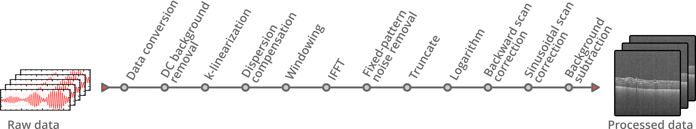
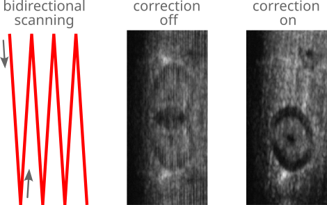

# Processing Pipeline

The OCT signal processing is entirely performed on the GPU. The spectral interferograms acquired by the OCT system are transferred to RAM until a user-defined number of B-scans is collected. This raw data batch is then copied to GPU memory for processing and display. Finally, the processed data is copied back to RAM, where it can be used for further analysis by plugins or saved to disk.

The following image shows the processing pipeline. Although most processing steps are optional, data conversion, IFFT, and truncation are essential steps that can not be disabled.

<figure markdown="span">
    
    <figcaption>OCTproZ processing pipeline</figcaption>
</figure>

## Processing Steps

### Data conversion

The first step of the OCT processing pipeline converts the incoming raw data, that may have a bit depth between 8 bit and 32 bit, to a single-precision, floating-point complex data type with a bit depth of 32 bit. This ensures that the processing pipeline can be executed for a variety of different input data types. Furthermore, a bit shift operation can be applied during the conversion process if necessary. Some digitizers, that are commonly used for swept-source OCT (SS-OCT), can be configured to use 16-bit integers to store 12-bit sample values in the most significant bits (e.g. ATS9373, Alazar Technologies Inc.). To extract the actual 12-bit value a right-shift by 4, which is equal to a division by 16, needs to be applied to every 16-bit integer.

### DC background removal
The DC component of the OCT signal is usually visible at the top of each B-scan as a bright line. To remove this DC component from each raw spectrum  \( I_{\mathrm{raw}}[m] \), a rolling average with a user-adjustable window size \( W \) can be computed and subtracted from the raw signal. Ignoring boundary checks, the DC‑corrected signal is calculated by

$$
	I_{\mathrm{ac}}[m] = I_{\mathrm{raw}}[m] - \frac{1}{2W} \sum_{n=m-W+1}^{m+W} I_{\mathrm{raw}}[n].
$$

In cases where the DC component does not vary significantly over time, the [fixed-pattern noise removal](#fixed-pattern-noise-removal) step can also eliminate it. 

### k-linearization

To convert the acquired raw OCT data into a depth profile, an inverse Fourier transform can be used, which relates wavenumber _k_ to physical distance. For optimal axial resolution, the raw data must be uniformly sampled in _k_-space. However, depending on the used hardware setup, the acquired spectral fringe pattern is usually not linear in _k_. In swept-source OCT, the wavenumber-time characteristics of the light source are often non-linear. In spectrometer-based OCT systems, the exact pixel position to wavenumber relationship depends on the optical elements of the spectrometer. There are hardware based approaches that enable a _k_-linear sampling like using a _k_-clock for non-linear temporal sampling of the raw signal in swept-source OCT or using special _k_-linear spectrometer designs.

Alternatively, there are software-based approaches to generate a signal with a _k_-space uniform sampling by resampling the data such that the data points are evenly distributed in _k_-space. This process is known as _k_-linearization. For the software-based approach in OCTproZ, a user-defined resampling curve \( r[m] \) can be specified by providing the coefficients of a third-order polynomial. The resampling curve is a lookup table that assigns every index \( m \) of the raw data array \( I_{\mathrm{raw}}[m] \) an index \( m^\prime \), i.e. \( m^\prime = r[m] \). To obtain a _k_-linearized raw data array \( I_{\mathrm{k}}[m] \), the sample value at the index \( m^\prime \) needs to be interpolated and remapped to the array position with index \( m \). The simplest way to do this is by using linear interpolation:

$$
	I_{\mathrm{k}}[m] 
	= I_{\mathrm{raw}}[\lfloor m^\prime \rfloor] 
	+ \bigl(m^\prime - \lfloor m^\prime \rfloor \bigr) 
	  \bigl(I_{\mathrm{raw}}[\lfloor m^\prime \rfloor+1] - I_{\mathrm{raw}}[\lfloor m^\prime \rfloor]\bigr)
$$

\( \lfloor x \rfloor \) denotes the floor function that takes as input \( x \), a real number, and gives as output the greatest integer less than or equal to \( x \).

!!! note
    The polynomial used for the resampling curve has the form:  
    r(m) = c0 + (c1/N)m + (c2/N2)m2 + (c3/N3)m3  
    where N is the number of samples per raw A-scan - 1.

<!---
!!! note
	The polynomial used for the resampling curve has the form:
	
	$$
	c_{0} + \frac{c_{1}}{N} x + \frac{c_{2}}{N^2} x^2 + \frac{c_{3}}{N^3} x^3
	$$
	
	where N is the number of samples per raw A-scan - 1.
-->

!!! note
    A custom resampling curve (that does not need to be a polynomial fit) can be loaded by clicking on *Extras → Resampling curve for k-linearization → Load custom curve from file...*  
    The structure of the csv file with the curve data should be the same as the structure of the csv file that you get by right clicking on the resampling curve plot in the sidebar and saving the plot as csv file.

!!! note 
    You can use the [PhaseExtractionExtension](https://github.com/spectralcode/PhaseExtractionExtension) for easy resampling curve determination.

Currently, three interpolation methods are available in OCTproZ: Linear, Cubic Spline (Catmull-Rom Spline), and Lanczos. These methods represent a trade-off between speed and accuracy, with Linear being the fastest and Lanczos being the most accurate. The figure below shows typical interpolation artifacts that can be seen when using the different interpolation methods:

<figure markdown="span">
    
    <figcaption>Image artifacts of different interpolation methods for k-linearization indicated by red arrows</figcaption>
</figure>

### Dispersion compensation

Differences in the dispersive media lengths in the sample and reference arms of an OCT system introduce a wavenumber‑dependent phase shift on the raw signal that degrades axial resolution of the processed OCT images. While hardware‑based methods (e.g. prism pairs used as variable‑thickness windows) can physically balance dispersion mismatch, numerical dispersion compensation offers a flexible alternative, especially in cases where the mismatch is mainly caused by the sample and not only by the optical setup itself.

In numerical dispersion compensation, the raw signal \( I_{\mathrm{raw}}[m] \) is corrected by multiplying it with a phase term that cancels the dispersion‑induced phase shift:

$$
	I_{\mathrm{comp}}[m] = I_{\mathrm{raw}}[m] \cdot e^{-i\,\theta\bigl(k\bigr)},
$$

where \( \theta(k) \) is a user‑defined phase function. Expressing the phase term in its real and imaginary parts as

$$
	e^{-i\,\theta\bigl(k\bigr)} = \cos\bigl(\theta(k)\bigr) - i\,\sin\bigl(\theta(k)\bigr)
$$

and noting that the imaginary part of \( I_{\mathrm{raw}}[m] \) is zero, the multiplication simplifies to

$$
	\begin{aligned}
		\mathrm{Re}\{ I_{\mathrm{comp}}[m] \} &= I_{\mathrm{raw}}[m] \cdot \cos\bigl(\theta(k)\bigr),\\
		\mathrm{Im}\{ I_{\mathrm{comp}}[m] \} &= -I_{\mathrm{raw}}[m] \cdot \sin\bigl(\theta(k)\bigr).
	\end{aligned}
$$

This simplified calculation avoids performing a full complex multiplication. This appraoch is slightly different from the one described by [Maciej Wojtkowski et al. (2004)](https://doi.org/10.1364/OPEX.12.002404). In their method, the Hilbert transform is used to generate the imaginary part of the raw signal, and then a full complex multiplication is performed. Both approaches result in identical OCT data.

The phase function \( \theta(k) \) is implemented as a third‑order polynomial with coefficients \( d_0, d_1, d_2, d_3 \), which can be set in the GUI. \( d_0 \) does not change the resulting OCT images at all; \( d_1 \) can be used to shift the OCT image in axial direction without altering the axial resolution. Only \( d_2 \) and \( d_3 \) are responsible for the actual dispersion compensation that can improve axial resolution. 

In many cases, it is possible to find good values for \( d_2 \) and \( d_3 \) by manually varying them  until the resulting image shows the best axial resolution. However, it is also possible to use the [dispersion estimator extension](https://github.com/spectralcode/DispersionEstimatorExtension) to obtain suitable coefficient values by optimizing an A-scan quality metric. 

### Windowing

The raw data is multiplied by a window function, which sets the signal to zero outside of a predefined interval. This reduces side lobes in the resulting signal after IFFT. The GUI allows to choose between different window functions (Gaussian, Hanning, Sine, Lanczos and Rectangular window) and to set their width and center position.

### Inverse Fast Fourier Transform (IFFT)

The inverse Fourier transform is the essential processing step to calculate the depth profile from a spectral interferogram. The IFFT output is normalized by dividing each sample by the total number of samples.

### Fixed-pattern noise removal

Fixed pattern noise refers to structural artifacts in OCT images that appear as fixed horizontal lines. These artifacts are caused, for example, by variations in pixel response in the CCD camera in spectrometer based OCT systems or spurious etalons within the optical OCT setup. A common approach to reduce fixed pattern noise is to acquire a reference signal in absence of a sample and subtract it from all subsequent recordings. In OCTproZ, the minimum-variance mean-line subtraction method that was described by [Moon et al. (2010)](https://doi.org/10.1364/OE.18.024395) can be used. This approach does not require an additional reference recording and can be applied continuously such that fixed pattern noise due spectral intensity variation of the source is reduced as well.

### Truncate

This step removes the mirror image on the opposite side of zero pathlength by cropping half of the processed OCT data. The mirror image is sometimes referred to as mirror artifact or complex conjugate artifact. It originates from the fact that the inverse Fourier transform is applied to a real-valued signal which results in a conjugate symmetric signal (i.e. the positive and negative distances are complex conjugates of each other).

### Logarithm and dynamic range adjustment

For better visualization of OCT data, some form of dynamic range compression is usually used because the smallest and largest signals can differ by several orders of magnitude. The most common method, which is also used in OCTproZ, is simply to take the logarithm of the signal after IFFT:

$$
i[z] = 20 \, \log_{10}\!\left|\mathcal{F}^{-1}\{I_k[m]\}\right|
$$

In addition, dynamic range adjustment is performed to enable the user to set minimum and maximum values (in dB) that should be displayed:

$$
i_{\text{adj}}[z] = \text{coeff} \left( \frac{i[z]- \text{min}}{\text{max} - \text{min}} + \text{addend} \right),
$$

The parameters **coeff**, **min**, **max**, and **addend** can be set by the user. Usually, **min** and **max** are chosen so that the noise floor in the OCT images appears quite dark and the actual signal of interest appears bright. **Coeff** can be used to adjust the contrast of the image, and **addend** can be used to adjust the brightness. Typically, these values are set to **coeff = 1** and **addend = 0**.

### Backward scan correction

To increase frame rate, a bidirectional scanning scheme can be used. However, this means that every other frame is flipped. The backward scan correction step unflips these frames.

<figure markdown="span">
    
    <figcaption>Bidirectional scanning scheme and the effect of backward scan correction on the en face view</figcaption>
</figure>

The image above shows the effect of the backward scan correction on the en face view of an OCT volume that was acquired using a bidirectional scanning scheme. A piece of wood with a laser burned hole was used as sample. Left: Spot path on sample when a bidirectional scanning scheme is applied. Middle: En face view with enabled backward scan correction. Right: En face view when backward scan correction is disabled.

### Sinusoidal scan correction

A resonant scanner can be used for high-speed OCT systems. Due to the sinusoidal scan motion, the resulting images are distorted. This processing step uses linear interpolation to unstretch this sinusoidal distortion. The figure below shows the effect of this processing step.

<figure markdown="span">
    
    <figcaption>En face view of a grid structure acquired with sinusoidal scanning. Left: sinusoidal scann correction not applied, distortions visible. Right: en face view after applying sinusoidal scan correction, </figcaption>
</figure>

### Post-processing background subtraction

In some cases, residual horizontal lines may persist even after DC background removal and fixed-pattern noise correction. Additionally, other types of artifacts, such as axial intensity gradients, can still be present. This post-processing background subtraction step can be used to reduce these artifacts.

A background A-scan \( i_{\text{bg}}[z] \) is first computed by averaging all A-scans from a separate background recording. During processing, each A-scan \( i[z] \) is then corrected by subtracting a scaled and offset version of this background:

$$
i_{\text{corr}}[z] = i[z] - (w \cdot i_{\text{bg}}[z] + o)
$$

where \( w \) is a user-defined weight factor and \( o \) is a user-defined offset.

### Final data conversion and export

Before the processed OCT data is transferred to CPU memory — either for saving to disk or for use by other plugins — it is converted back to the original raw data bit depth. During this conversion, out-of-range values are clamped, and the data is scaled to the entire value range of the target bit depth (e.g., 0–255 for 8-bit, 0–65535 for 16-bit).

Alternatively, for saving to disk, this conversion can be disabled. In this case, the internal 32-bit floating-point data is transferred to CPU memory and saved directly to disk without any additional scaling or clamping (except for the scaling already applied in the _Logarithm and dynamic range adjustment_ step). Note that this option only affects saving to disk — processed data streamed to plugins is always converted to the original raw data bit depth.

## Effect of single processing steps

To illustrate the effect of single processing steps, B-scans of an OCT phantom (APL-OP01, Arden Photonics, UK) were acquired with a custom made SS-OCT system without k-klocking and with a slight dispersion imbalance. The acquired raw data was processed multiple times, each time with a different processing step disabled:

<figure markdown="span">
    
    <figcaption>The B-scans show a test pattern of an OCT phantom (APL-OP01, Arden Photonics, UK). Below each B-scan is an enlarged view of a corresponding area framed in red within the B-scan. a) The full processing pipeline is enabled. b) k linearization is disabled (all other steps are enabled). c) Dispersion compensation is disabled (all other steps are enabled). d) Windowing is disabled (all other steps are enabled). e) Fixed-pattern noise removal is disabled (all other steps are enabled). The red arrows point to horizontal structural artifacts that are visible if fixed-pattern noise removal is disabled.</figcaption>
</figure>

<!---

## Literature 
If you are interested in reading more about OCT processing in general, here are some recommendations:
- [Kalkman, J. "Fourier‐Domain Optical Coherence Tomography Signal Analysis and Numerical Modeling." International Journal of Optics 2017.1 (2017): 9586067.](https://onlinelibrary.wiley.com/doi/pdf/10.1155/2017/9586067) 

-->