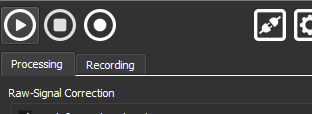
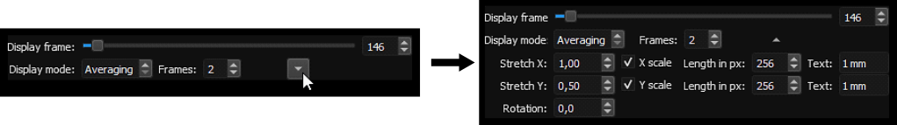

# Quick Start Guide

This section shows you how to load an OCT raw dataset with the Virtual OCT System Extension that is provided with OCTproZ. For testing purposes you can download a test data set from [here](https://figshare.com/articles/SSOCT_test_dataset_for_OCTproZ/12356705).

### 1. Open Virtual OCT System

Click on *File → Open System*

The system manager opens in a new window. Select "Virtual OCT System" and click on "Select"

### 2. Set Virtual OCT System settings

Click on *File → System Settings*

The system settings window opens. Click on *Select file* and select the OCT raw data file you want to open. Enter the parameters in the settings window according the dimensions of your raw data (bit depth per sample, samples per line,...). For more information on the individual parameters, click on the question mark in the upper right corner and then on the input field you would like to learn more about.

### 3. Set processing parameters in sidebar

Enter suitable processing parameters in the sidebar. The white curves in the k-linearization, dispersion compensation and windowing plots are reference curves that indicate how a curve would look like that does not effect the processing result at all. In other words: If your curve looks exactly as the white curve then the processing result will not change if this particular processing step is deactivated. For more information on processing, see the [processing pipeline section](processing.md).

### 4. Start the processing

Click on the "Start" button in the top left of the sidebar.

### 5. Adjust display settings

Hover your mouse over one of the output windows and a control panel will appear that you can use to adjust the display settings.

