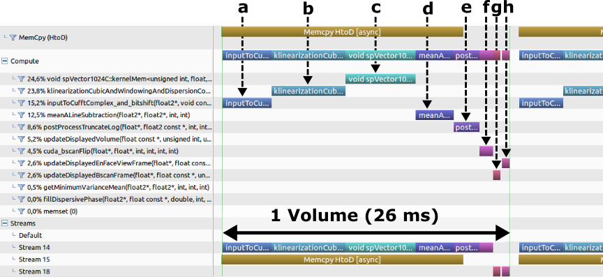

 #  OCTproZ - Performance Information

Processing rate highly depends on the size of the raw data, the used computer hardware and resource usage by background or system processes. With modern computer hardware and typical data dimensions for OCT, OCTproZ achieves A-scan rates in the MHz range.

A test data set with 12 bit per sample, 1024 samples per raw A-scan, 512 A-scans per B-scan and 256 B-scans per volume was used to measure the performance on different systems:

| |**Office Computer**|**Lab Computer**|**Gaming Computer**|
|:-----|:-----|:-----|:-----|
|CPU|Intel® Core i5-7500|AMD Ryzen™ Threadripper 1900X|AMD Ryzen™ 5 1600|
|RAM|16 GB|32 GB|16 GB|
|GPU|NVIDIA Quadro K620|NVIDIA GeForce GTX 1080 Ti| NVIDIA GeForce GTX 1080
|Operating system|Windows 10|Ubuntu 16.04| Windows 10|
|A-scan rate with 3D view| ~ 250 kHz ( ~1.9 volumes/s)|~ 4.0 MHz (~ 30 volumes/s)|~ 2.1 MHz (~ 16 volumes/s)|
|A-scan rate without 3D view| ~ 300 kHz ( ~2.2 volumes/s)|~ 4.8 MHz (~ 36 volumes/s)|~ 2.7 MHz (~ 19 volumes/s)|

Office Computer, Lab Computer:  
The performance was measured with the full processing pipeline of OCTproZ v1.0.0. The same performance is expected with OCTproZ v1.2.0 if live sinusoidal scan distortion correction is disabled.

Gaming Computer: 
The performance was measured with OCTproZ v1.2.0 with disabled live sinusoidal scan distortion correction.

Here are the relevant parameters that were used with Virtual OCT System and OCTproZ to determine the performance:

| |**Office Computer**|**Lab Computer**|**Gaming Computer**|
|:-----|:-----|:-----|:-----|
|**Virtual OCT System Settings**| | |
|bit depth [bits]|12|12|12|
|Samples per raw A-scan|1024|1024|1024|
|A-scan per B-scan|512|512|512|
|B-scans per buffer|32|256|256|
|Buffers per volume|8|1|1|
|Buffers to read from file|16|2|2|
|Wait after file read [us]|100|100|100|
|**OCTproZ Settings**| | |
|Bit shift sample values by 4|enabled|enabled|enabled|
|Flip every second B-scan|enabled|enabled|enabled|
|k-linearization|enabled|enabled|enabled|
|Dispersion Compensation|enabled|enabled|enabled|
|Windowing|enabled|enabled|enabled|
|Fixed-Pattern Noise Removal|enabled|enabled|enabled|
|B-scans for noise determination:|1|26|1|
|&emsp;once at start of measurement|enabled|enabled|enabled|
|&emsp;continuously|disabled|disabled|disabled|
|Sinusoidal scan correction|disabled|disabled|disabled|
|Log scaling|enabled|enabled|enabled|
|Stream Processed Data to Ram|enabled|disabled|disabled|

How to Determine Performance
--------
 OCTproZ provides live performance information within the sidebar in the "Processing"-tab. Live performance estimation is performed and updated every 5 seconds.
 
 It is also possible to use the [NVIDIA Visual Profiler](https://developer.nvidia.com/nvidia-visual-profiler) to analyze performance in more detail.

 For example, the following screenshot from the NVIDIA Visual Profiler shows the performance analysis of the above measurement (without 3D live view) with the lab computer:

 

  

The individual kernels are marked alphanumerically:  
&emsp;a) data conversion  
&emsp;b) kernel that combines k-linearization, windowing and dispersion compensation 
&emsp;c) IFFT 
&emsp;d) subtraction step of fixed pattern noise removal 
&emsp;e) truncate and logarithm 
&emsp;f) backward scan correction 
&emsp;g) copy B-scan frame to display buffer  
&emsp;h) copy en face view to display buffer 

Additional Information
--------
- Processing happens in batches. One batch is equal to one buffer and the size of the buffer has impact on processing performance. If it is too small the processing may be slower than possible. If it is too large the application may crash as a larger buffer size results in higher GPU memory usage, which can exceed the available memory on the used GPU 
- The optimal buffer size for a specific GPU needs to be determined experimentally 
- In Virtual OCT System the buffer size can be changed by changing _bit depth_, _Samples per raw A-scan_, _A-scan per B-scan_ and _B-scans per buffer_.
- When _B-scans per buffer_ is changed in Virtual OCT System, you should also change _Buffers per Volume_ and _Buffers to read from file_ accordingly 
- If OCTproZ crashes after setting the parameters in Virtual OCT System and starting the processing, try reducing the buffer size (for example instead of _B-scans per buffer_: 256, _Buffers per volume_: 1, _Buffers to read from file_: 2, you could try: _B-scans per buffer_: 128, _Buffers per volume_: 2, _Buffers to read from file_: 4)
- In Virtual OCT System a value greater than 2 for _Buffers to read from file_ will result in a slower processing rate displayed by OCTproZ. The reason for that is that Virtual OCT System takes more time to provide the raw data if more than two buffers should be read from a file. The processing itself is not slowed down just the time between two batches is increased. 

For performance  determination, you can use the provided [test data set](https://figshare.com/articles/SSOCT_test_dataset_for_OCTproZ/12356705). To replicate the measurements from above you need to set the value for _Samples per raw A-scan_ to 1024. This will cause the resulting OCT images to look distorted as the test data set was recorded with 1664 samples per raw A-scan. This is expected behavior that does not invalidate the performance measurement.

