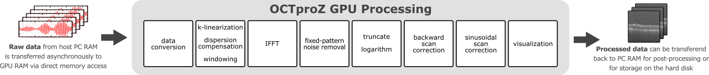
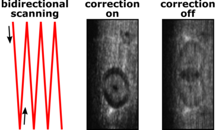
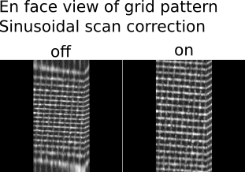
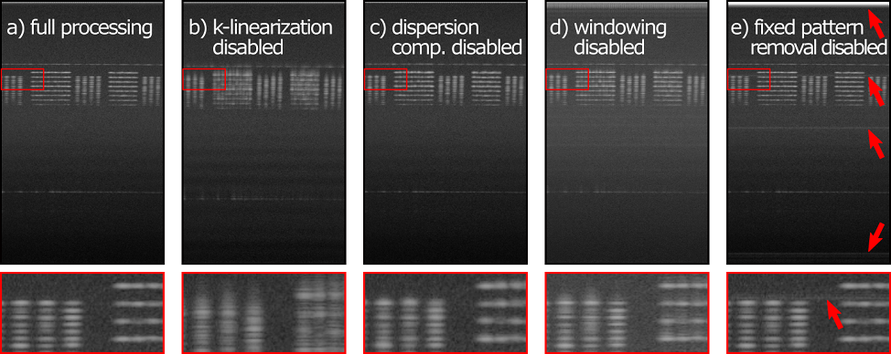

 #  OCTproZ - Processing Overview

This is an overview of the OCTproZ processing pipeline.   
OCT raw data from the OCT system is transferred to RAM
until a user-defined amount of B-scans is acquired (B-scans per buffer). Via direct memory access (DMA) this raw data batch is then copied asynchronously to GPU memory where OCT signal processing is performed. 

  

Each box in the image above represents a CUDA kernel. Some processing steps are combinend into a single kernel (e.g. k-linearization, dispersion compensation and windowing) to enhance processing performance. 

Processing Steps
--------

* **Data conversion**   
The first step of the OCT processing pipeline converts the incoming raw data, that may have a bit depth between 8 bit and 32 bit, to a single-precision, floating-point complex data type with a bit depth of 32 bit. This ensures that the processing pipeline can be executed for a variety of different input data types. Furthermore, a bit shift operation is applied during the conversion process if necessary. Some digitizers, that are commonly used for swept source OCT (SS-OCT), can be configured to use 16-bit integers to store 12-bit sample values in the most significant bits (e.g. ATS9373, Alazar Technologies Inc.). To extract the actual 12-bit value a right-shift by 4, which is equal to a division by 16, needs to be applied to every 16-bit integer.  

* **k-linearization**   
To convert the acquired raw OCT data into a depth profile, inverse Fourier transform is used, which relates wavenumber k and physical distance. Depending on the used hardware setup, the acquired spectral fringe pattern is usually not linear in k. In SS-OCT the temporal sampling points do not necessarily have to be spaced in k domain evenly, especially if k clocking is not used and in spectrometer based FD-OCT systems the interference signal is usually acquired linear in wavelength. The k-linearization resamples the raw data evenly in k space, which improves axial resolution. 
A user defined resampling curve r[j] can be specified by providing the coefficients of a third order polynomial. The resampling curve is a look up table that assigns every index j of the raw data array  an index j', i.e. j'=r[j]. To obtain a k-linearized raw data array , the value at the index j' needs to be interpolated and remapped to the array position with index j. In the current version of OCTproZ the user can choose between linear and 3rd order polynomial interpolation for this task. The equation below describes the k-linearization with linear interpolation;  denotes the floor function that takes as input x a real number and gives as output the greatest integer less than or equal to x.   
  
 

<!---
S_k[j] = S_{raw}[\lfloor j' \rfloor] + (j' - \lfloor j' \rfloor )(S_{raw} [ \lfloor j' \rfloor +1]-S_{raw} [ \lfloor j' \rfloor ]) 
-->

* **Dispersion compensation**   
If sample and reference arm of an OCT system contain different length of dispersive media, a wavenumber dependent phase shift is introduced to the signal and axial resolution decreases. In this case, a hardware based dispersion compensation, such as variable-thickness fused-silica and BK7 prisms, can be used. A more convenient way to compensate for the additional phase shift, especially if the dispersion mismatch is introduced mainly by the sample itself, is numerical dispersion compensation. Hereby the signal is multiplied with a phase term ⅇ^(-ⅈθ(k)) that exactly cancels the phase shift introduced due dispersion mismatch. A user defined phase θ(k) can be specified in the GUI by providing the coefficients of a third order polynomial.  

* **Windowing**   
The raw data is multiplied with a window function, which sets the signal to zero outside of a predefined interval. This reduces side lobes in the resulting signal after IFFT. The GUI allows to choose between different window functions (Gaussian, Hanning, Sine, Lanczos and Rectangular window) and to set their width and center position. 

* **IFFT**   
The inverse Fourier transformation is the essential processing step to calculate the depth profile from the acquired and pre-processed (k-lineariziation, dispersion compensation, windowing) fringe pattern. OCTproZ utilizes the NVIDIA CUDA Fast Fourier Transformation library (cuFFT) to execute the inverse Fast Fourier Transform (IFFT). 

* **Fixed-pattern noise removal**   
Fixed pattern noise refers to structural artifacts in OCT images that appear as fixed horizontal lines. These artifacts are caused, for example, by variations in pixel response in the CCD camera in spectrometer based OCT systems or spurious etalons within the optical OCT setup. A common approach to reduce fixed pattern noise is to acquire a reference signal in absence of a sample and subtract it from all subsequent recordings. In OCTproZ we have implemented the minimum-variance mean-line subtraction method that was described by Moon et al. [https://doi.org/10.1364/OE.18.024395] This approach does not require an additional reference recording and can be applied continuously such that fixed pattern noise due spectral intensity variation of the source is reduced as well.   

* **Truncate**   
This step removes the mirror image of each B-scan which naturally occurs after IFFT. Since the inverse Fourier transformation is applied to a real-valued signal, the result must be Hermitian symmetric. As consequence, mirror images, with the zero path reference as the mirror axis, can be seen in the resulting B-scans. If numerical dispersion correction is applied prior IFFT these mirror images are not identical with their counterparts but appear blurred. To avoid displaying duplicate or blurred images and reduce data size the data is truncated.  

* **Logarithm**   
Dynamic range compression (logarithm of magnitude) prepares the data for visualization. 

* **Backward scan correction**   
To increase frame rate, a bidirectional scanning scheme can be used. However, this means that every other frame is flipped horizontally. The backward scan correction step unflippes these frames. 

 The image above shows the effect of the backward scan correction on the en face view of an OCT volume that was acquired using a bidirectional scanning scheme. A piece of wood with a laser burned hole was used as sample. Left: Spot path on sample when a bidirectional scanning scheme is applied. Middle: En face view with enabled backward scan correction. Right: En face view when backward scan correction is disabled. 
 
* **Sinusoidal scan correction**   
A resonant scanner can be used for high speed OCT-systems. Due to the sinusoidal movement of the scanner the resulting B-scans would be distorted without this processing step as can be seen in the figure below. 

  

* **Visualization**   
For live visualization of the processed data in 2D and 3D, the user has access to three different output windows: B-scan, en face view and volume. B-scan and en face view are orthogonal cross-sectional slices of the volume, which can be maximum intensity projections or averaged layers of a user-defined amount of layers of the volume. For easier orientation red marker lines can be overlaid to indicate the current B-scan slice position within the en face view and vice versa.  
The interactive volume viewer displays acquired OCT volumes without cropping or downsampling in real time. As soon as one batch of data is processed, the corresponding part of the volume is updated and rendered with maximum intensity projection, alpha blending or isosurfaces. The volume viewer is based on source code from an open source raycaster. [https://github.com/m-pilia/volume-raycasting]
In order to avoid unnecessary data transfer to host memory, CUDA-OpenGL interoperability is used which allows the processed data to remain in GPU memory for visualization. 
However, it is possible to transfer the data to the host memory to save it on the hard disk, display individual axial depth profiles, so-called A-scans, in a 1D plot or use it within custom Extensions. 

# Effect of single processing steps

Every processing step, except data conversion and IFFT, can be enabled and disabled during processing. To illustrate the effect of single processing steps, B-scans of an OCT phantom (APL-OP01, Arden Photonics, UK) were acquired with a custom made SS-OCT system without k-klocking and with a slight dispersion imbalance. The acquired raw data was processed multiple times, each time with a different processing step disabled: 

  
The B-scans above show a test pattern of an OCT phantom (APL-OP01, Arden Photonics, UK). Below each B-scan is an enlarged view of the corresponding area framed in red within the B-scan. a) The full processing pipeline is enabled. b) k linearization is disabled (all other steps are enabled). c) Dispersion compensation is disabled (all other steps are enabled). d) Windowing is disabled (all other steps are enabled). e) Fixed-pattern noise removal is disabled (all other steps are enabled). The red arrows point to horizontal structural artifacts that are visible if fixed-pattern noise removal is disabled.
